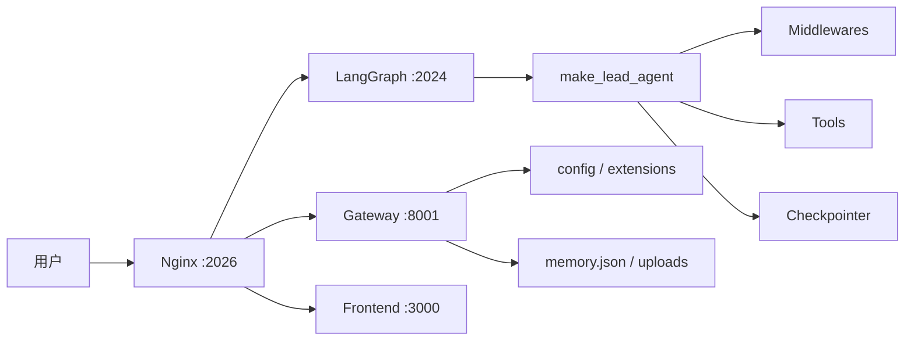

# 项目概览

## 定位

DeerFlow 是面向**复杂任务执行**的 Agent 运行时（`super agent harness`），不是单一聊天应用。核心能力：主/子 Agent、**沙箱**、长期记忆、技能、MCP、多入口（Web / IM / 嵌入式 Python）。

**代码重心**：`backend/packages/harness/deerflow/`（编排、工具、沙箱、记忆、MCP、配置）；`backend/app/`（Gateway、IM 通道）。

## 分层架构

- **执行面**：LangGraph 中的 `lead_agent`（见 `backend/langgraph.json`）。
- **管理面**：Gateway（模型、上传、技能、MCP、记忆文件等）。

本地统一入口：`make dev` → `http://localhost:2026`（细节见根目录 `Makefile` / `scripts/serve.sh`）。

## 核心装配点（读代码时抓这五处）

`make_lead_agent()` 集中处理：

- `create_chat_model()` — 模型
- `get_available_tools()` — 工具（含沙箱、MCP、子 Agent）
- `_build_middlewares()` — 横切逻辑
- `apply_prompt_template()` — 系统提示词（含记忆注入）
- `ThreadState` — 会话状态形状

主入口：`backend/packages/harness/deerflow/agents/lead_agent/agent.py`。

## 差异化能力（简表）

| 能力 | 说明 |
|------|------|
| 线程工作区 | `threads/{thread_id}/user-data`，沙箱内映射为 `/mnt/user-data` |
| 沙箱 | Local 子进程 / Docker / K8s（Provisioner）— **详见 [06-sandbox-provisioner-memory.md](06-sandbox-provisioner-memory.md)** |
| 子 Agent | `task` 工具 + `SubagentExecutor` |
| 记忆 | `memory.json` 注入 prompt；与 checkpointer 多轮状态分离 — **详见 06** |
| 扩展 | MCP、`extensions_config.json`、技能目录 |

## 成熟度（摘要）

架构与 harness 完整度较高；前端测试与 CI 弱于后端；生产 LangGraph 形态仍可能演进。展开见 [05-engineering-assessment.md](05-engineering-assessment.md)。

## 优先打开的文件

1. `Makefile`、`backend/langgraph.json`
2. `backend/app/gateway/app.py`
3. `backend/packages/harness/deerflow/agents/lead_agent/agent.py`
4. `backend/packages/harness/deerflow/agents/thread_state.py`
5. `backend/packages/harness/deerflow/tools/tools.py`、`config/app_config.py`
6. 沙箱与供给：`community/aio_sandbox/aio_sandbox_provider.py`、`docker/provisioner/app.py`（说明见 **06**）
