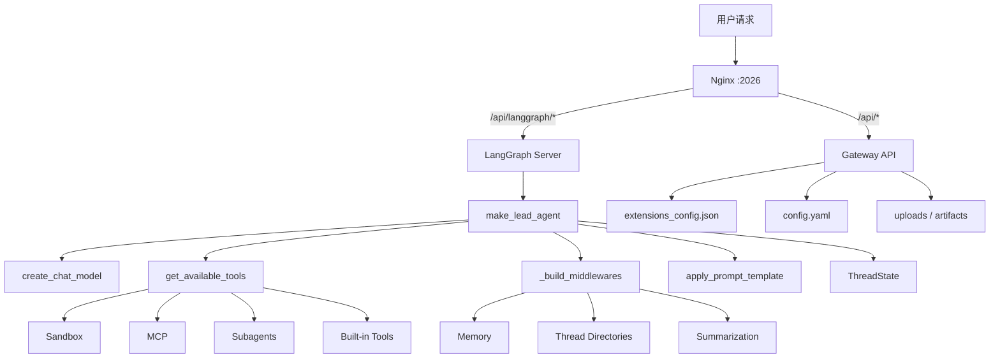
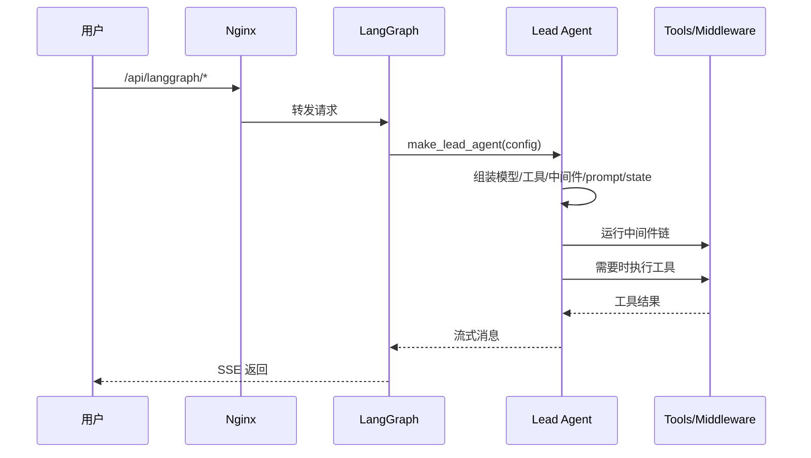
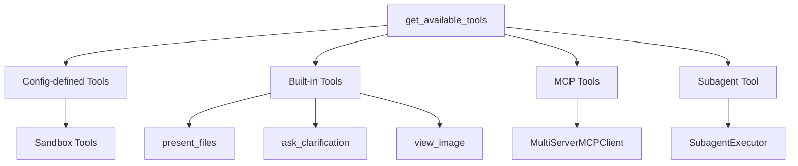
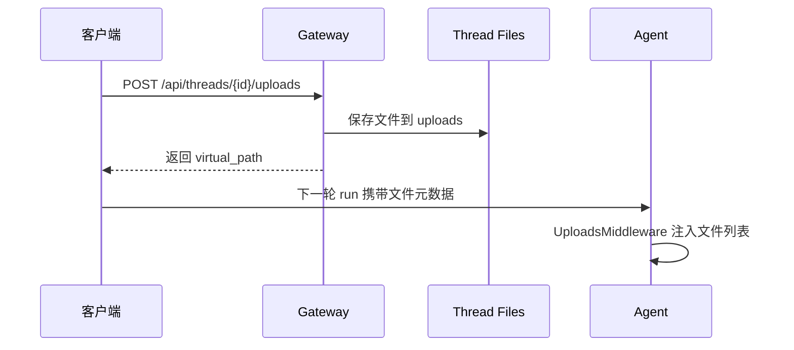
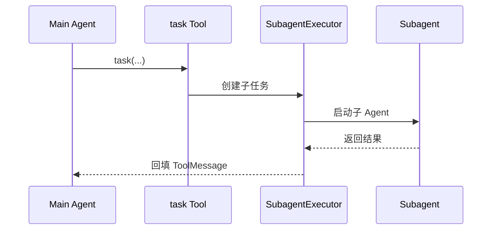

# 后端调用链导览

## 主执行架构

## 1. 启动链路

由 `Makefile` / `scripts/serve.sh` 编排 LangGraph → Gateway → Frontend → Nginx；注册入口与 checkpointer 见 `backend/langgraph.json` 与 Gateway `app.py`。总览见 [01-project-overview.md](01-project-overview.md)。

## 2. Web 对话主链路

这条链的核心意义是：真正执行任务的不是 Gateway，而是 LangGraph 中注册的 `lead_agent`。

## 3. `make_lead_agent()` 组装链

主 Agent 的组装逻辑集中在 `backend/packages/harness/deerflow/agents/lead_agent/agent.py`。

可以归纳成五段：

1. 解析运行时配置
2. 解析模型
3. 加载工具
4. 组装中间件
5. 生成系统提示词并创建 Agent

对应的五个核心点：

- `create_chat_model()`
- `get_available_tools()`
- `_build_middlewares()`
- `apply_prompt_template()`
- `ThreadState`

## 4. 中间件调用链

中间件链是后端行为差异的关键来源。

```mermaid
flowchart LR
    A[ThreadDataMiddleware] --> B[UploadsMiddleware]
    B --> C[SandboxMiddleware]
    C --> D[SummarizationMiddleware]
    D --> E[TodoMiddleware]
    E --> F[TitleMiddleware]
    F --> G[MemoryMiddleware]
    G --> H[ViewImageMiddleware]
    H --> I[SubagentLimitMiddleware]
    I --> J[LoopDetectionMiddleware]
    J --> K[ClarificationMiddleware]
```

其中几个最重要的职责：

- `ThreadDataMiddleware`：初始化线程目录
- `UploadsMiddleware`：把上传文件注入上下文
- `SandboxMiddleware`：获取沙箱环境
- `MemoryMiddleware`：把对话送入记忆更新链
- `ClarificationMiddleware`：把澄清请求变成中断流程

## 5. 工具装配链

工具系统的入口是 `get_available_tools()`。

工具来源包括：

- `config.yaml` 中配置的工具
- 内置工具
- MCP 动态加载工具
- 可选的子代理工具 `task`

## 6. 沙箱执行链

工具侧：`ensure_sandbox_initialized()` → `SandboxMiddleware` 与 `thread_id`；`bash`/`read_file` 等经 `sandbox/tools.py` 调用具体 `Sandbox` 实现。

**三种实现（Local 子进程 / Docker HTTP / K8s Provisioner）、`release` 与 warm 池、卷与 `memory.json` 边界** 见专题 **[06-sandbox-provisioner-memory.md](06-sandbox-provisioner-memory.md)**。

## 7. 上传文件链

文件上传不直接进 LangGraph，而是先走 Gateway。

这意味着上传是控制面能力，而不是 Agent runtime 本身直接接收二进制文件。

## 8. MCP 配置热更新链

MCP 和技能配置通过 Gateway 修改，但在 LangGraph 侧生效。

路径如下：

1. 客户端请求 Gateway
2. Gateway 写入 `extensions_config.json`
3. LangGraph 侧下次运行检查配置文件 mtime
4. 缓存失效
5. 工具集重建

这是一种典型的“控制面和执行面分离”的设计。

## 9. 子代理调用链

关键理解：

- 子代理不是独立系统
- 它本质上是主 Agent 的一种工具调用
- 并发与超时由 `SubagentExecutor` 统一管理

## 10. IM 渠道调用链

IM 渠道复用的是同一个 LangGraph 内核。

主链路：

1. 外部平台消息进入 `app/channels/*`
2. `ChannelManager` 统一分发
3. 通过 `langgraph-sdk` 创建或查找 thread
4. 调用 `runs.stream()` 或 `runs.wait()`
5. 再把结果回发到外部平台

这避免了 Web 和 IM 走两套执行逻辑。

## 阅读建议

1. `scripts/serve.sh`、`backend/langgraph.json`
2. `backend/app/gateway/app.py`
3. `agents/lead_agent/agent.py`、`thread_state.py`
4. `tools/tools.py`、`sandbox/tools.py`
5. 沙箱供给：`community/aio_sandbox/aio_sandbox_provider.py` + [06-sandbox-provisioner-memory.md](06-sandbox-provisioner-memory.md)
6. `subagents/executor.py`、`client.py`、`app/channels/manager.py`
