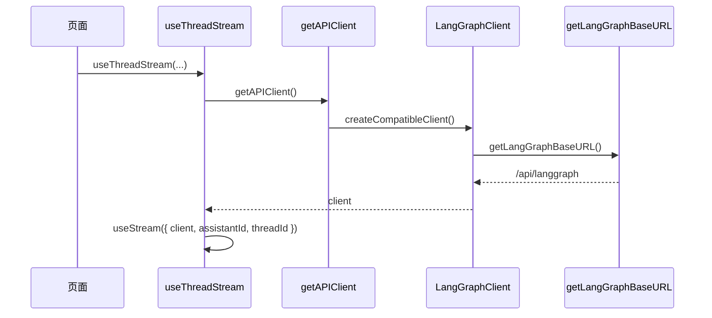

# 前端到 API 到 LangGraph SDK 的调用链

## 总体调用图

```mermaid
flowchart TD
    P[聊天页面] --> S[useThreadStream]
    AP[Agent 聊天页面] --> S

    P --> I[InputBox]
    AP --> I

    I -->|onSubmit| H[handleSubmit]
    H -->|sendMessage| S

    S --> U[useStream]
    S --> C[getAPIClient]
    C --> CC[createCompatibleClient]
    CC --> LGC[LangGraph Client]
    CC --> SM[sanitizeRunStreamOptions]

    LGC --> URL[getLangGraphBaseURL]
    URL --> N1[/api/langgraph]
    N1 --> Nginx[Nginx]
    Nginx --> LG[LangGraph Server]

    S --> SUBMIT[thread.submit]
    SUBMIT --> LG

    S --> UP[uploadFiles]
    UP --> GW[/api/threads/{id}/uploads]
    GW --> Gateway

    LG --> EVT[stream events]
    EVT --> U
    U --> S
    S --> UI[MessageList / ThreadTitle / TodoList]

    I --> SG[fetch suggestions]
    SG --> GW2[/api/threads/{id}/suggestions]
    GW2 --> Gateway
```

## 1. 页面入口层

前端主入口页面有两类：

- `frontend/src/app/workspace/chats/[thread_id]/page.tsx`
- `frontend/src/app/workspace/agents/[agent_name]/chats/[thread_id]/page.tsx`

两者都采用同一模式：

1. 调 `useThreadStream()` 获取线程对象和发送函数
2. 把线程交给 `MessageList`
3. 把 `handleSubmit` 交给 `InputBox`

区别只在于 Agent 专属聊天页会额外注入 `agent_name`。

## 2. 输入框层

`frontend/src/components/workspace/input-box.tsx` 负责：

- 收集文本输入
- 管理附件
- 切换模式
- 切换模型
- 触发提交

但它本身不直接调用 LangGraph SDK。它只做一件关键事情：

- 在表单提交后调用上层传入的 `onSubmit(message)`

因此输入层和 SDK 层之间是解耦的。

## 3. `useThreadStream()` 是桥梁

`frontend/src/core/threads/hooks.ts` 中的 `useThreadStream()` 是整个前端调用链的核心桥接层。

它负责：

- 初始化 `useStream()`
- 维护线程状态
- 发送消息
- 处理流式更新
- 维护 optimistic UI
- 更新 React Query 缓存

## 4. 初始化 SDK 链

初始化过程如下：

1. 页面调用 `useThreadStream()`
2. `useThreadStream()` 内部调用 `useStream()`
3. `useStream()` 使用 `getAPIClient()` 提供的 client
4. `getAPIClient()` 返回 `LangGraphClient` 单例



## 5. 地址解析链

LangGraph SDK 的请求地址由 `frontend/src/core/config/index.ts` 决定。

默认逻辑是：

- 如果配置了 `NEXT_PUBLIC_LANGGRAPH_BASE_URL`，优先使用它
- 否则在浏览器中使用 `window.location.origin + /api/langgraph`
- SSR 时回退到 `http://localhost:2026/api/langgraph`

这意味着前端默认不会直接访问 `:2024`，而是始终通过统一入口 `/api/langgraph`。

## 6. 消息发送链

消息发送分为两段。

### 6.1 附件上传

如果消息包含附件：

1. 前端先把文件转成 `File`
2. 调 `uploadFiles(threadId, files)`
3. 请求 Gateway 的 `/api/threads/{id}/uploads`
4. Gateway 返回 `virtual_path`
5. 前端把 `virtual_path` 放进消息元数据

### 6.2 提交 LangGraph run

在附件处理完成后，`useThreadStream()` 调用 `thread.submit()`：

- 发送 human message
- 附带 `additional_kwargs.files`
- 注入 `context`
- 注入 `config`

其中前端模式会被转换成后端运行参数：

- `flash` -> `thinking_enabled = false`
- `pro` -> `is_plan_mode = true`
- `ultra` -> `is_plan_mode = true` 且 `subagent_enabled = true`

这说明前端模式选择不是纯 UI 状态，而是直接参与后端 Agent 行为控制。

## 7. 流式返回链

`useStream()` 会持续接收 LangGraph 返回的流式事件，并交给 `useThreadStream()` 处理。

主要事件包括：

- `onCreated`
- `onLangChainEvent`
- `onUpdateEvent`
- `onCustomEvent`
- `onFinish`

这些回调承担的职责分别是：

- `onCreated`：拿到真实线程 ID
- `onLangChainEvent`：监听工具执行结束
- `onUpdateEvent`：更新标题等状态
- `onCustomEvent`：处理子任务运行中的自定义事件
- `onFinish`：完成后刷新线程列表

## 8. UI 消费链

`useThreadStream()` 返回的 `thread` 会被页面和组件层消费：

- `MessageList` 读取 `thread.messages`
- `ThreadTitle` 读取 `thread.values.title`
- `TodoList` 读取 `thread.values.todos`
- `ChatBox` 读取 `thread.values.artifacts`

因此前端的核心展示数据源不是局部组件状态，而是 LangGraph stream 驱动的线程状态对象。

## 9. React Query 的角色

React Query 主要用于：

- 线程列表查询
- 线程删除
- 线程标题重命名
- 在流式更新过程中同步列表缓存

这意味着：

- 对话正文依赖 `useStream()`
- 列表和辅助状态依赖 React Query

前端实际上用了“两套状态机制协作”：

- 流式线程状态
- 查询缓存状态

## 10. 非 SDK API 链

前端并不是所有请求都通过 LangGraph SDK。

直接走 Gateway 的主要包括：

- 上传文件
- 追问建议
- 模型列表
- 技能管理
- MCP 配置
- 其他管理接口

因此前端后端交互可以概括为两类：

### 运行时调用

通过 `langgraph-sdk` 发起：

- 线程创建
- 消息提交
- 流式接收
- 线程状态更新

### 管理类调用

通过 `fetch` 或自定义 hooks 发起：

- 上传
- 建议
- 模型查询
- 技能与 MCP 管理

## 11. 小结

运行时对话走 **`useThreadStream` → `useStream` / `thread.submit` → langgraph-sdk → `/api/langgraph`**；上传、建议、模型列表等走 **Gateway**（与 [03-backend-call-chain.md](03-backend-call-chain.md) 中「控制面 / 执行面」划分一致）。
